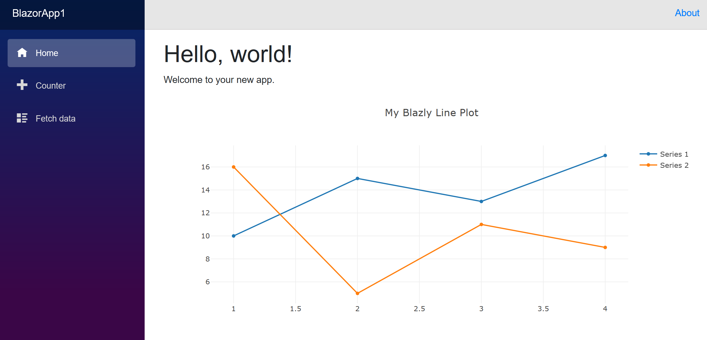

# Blazly

A .NET Core 3.0 Razor Component Library



## Dependendices

- [.NET Core 3.0 SDK](https://dotnet.microsoft.com/download)
- [Plotly.js](https://plot.ly/javascript/)

## Build

```csharp
dotnet build
```

## Use

1. Add reference to the project from Blazor/Razor Pages project
1. Copy the `plotlyInterop.js` and `plotly.min.js` files to the `wwwroot` of the web application that references this project.
1. Add the following lines at the end of your `body` tag in the `wwwroot/index.html` file.

```html
<script src="plotly.min.js"></script>
<script src="plotlyInterop.js"></script>
```

1. Add the following imports to the `_Imports.razor` file in the project directory.

```cshtml
@using Blazly
@using Blazly.Base
@using Blazly.Components
```

1. Add the following code to the Blazor/Razor page where the plot component will be used:

```cshtml
<Plot Id="myPlot"
      Data="@traces"
      Layout="@chartLayout"
      />

@code {
    Trace[] traces = new Trace[]
    {
        new Trace()
        {
            X=new float[] {1,2,3,4},
            Y=new float[] {10, 15, 13, 17},
            Name="Series 1",
            Type="scatter"
        },
        new Trace()
        {
            X=new float[] {1,2,3,4},
            Y=new float[] {16, 5, 11, 9},
            Name="Series 2",
            Type="scatter"
        }
    };

    Layout chartLayout = new Layout()
    {
        Title = "My Blazly Line Plot"
    };
}
```